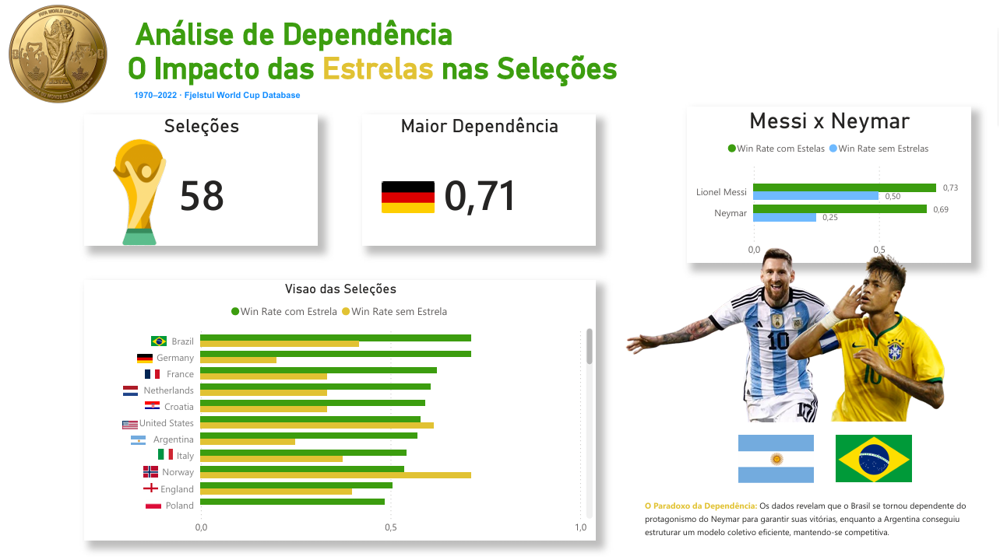

# Análise de Dependência: O Impacto das Estrelas nas Seleções

Projeto de análise de dados que busca responder: **quanto uma seleção depende do seu principal jogador para vencer?**
Utilizando dados históricos da Copa do Mundo 1970-2022, comparei o desempenho das seleções com e sem a presença de suas maiores estrelas, calculando a taxa de vitória em cada cenário e um índice de dependência para medir o impacto do atleta na equipe.

## Metodologia
Para cada seleção, foram analisados dois contextos:
- **Com a estrela:** partidas em que o jogador participou.
- **Sem a estrela:** partidas disputadas sem a presença do artilheiro.
Com base nesses dados, foi calculado um índice de dependência a partir da diferença entre as taxas de vitória.

## Tecnologias Utilizadas
- Python
- Pandas
- SQL
- Power BI

## Estudo de Caso
O projeto inclui uma análise geral de diversas seleções e um aprofundamento em três dos maiores jogadores da era moderna:
- Lionel Messi (Argentina)
- Neymar (Brasil)
- Cristiano Ronaldo (Portugal)

## Principais Resultados

- **Argentina:** forte dependência de Messi, com aumento significativo da taxa de vitórias quando ele está em campo.
- **Brasil:** dependencia relevante, Neymar, indicando uma equipe dependente, diferente de quando analisado em anos anteriores a era atual, o Brasil era pouco dependente.
- **Portugal:** quantidade insuficiente de partidas sem Cristiano Ronaldo para uma comparação estatisticamente confiável.

## Objetivo
Transformar dados históricos do futebol de forma que ajude a entender o impacto real dos grandes players no desempenho de suas seleções.

